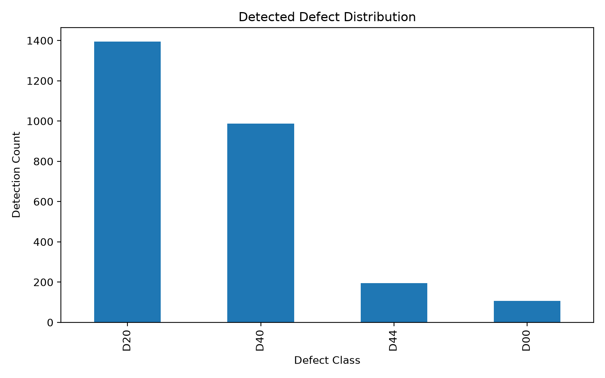
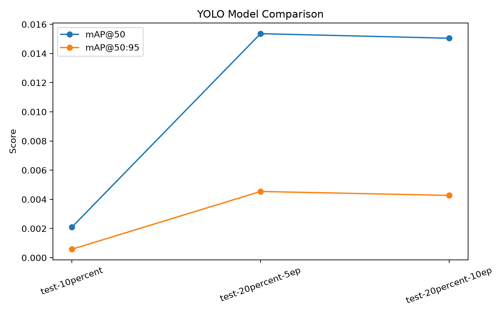
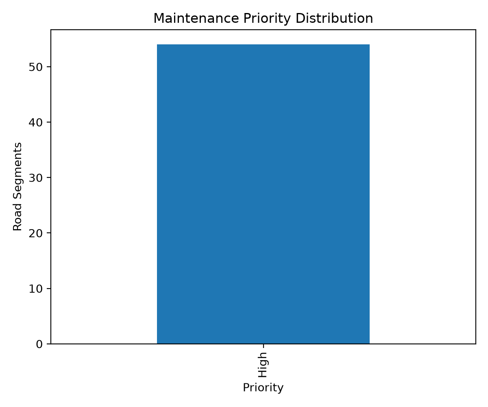

# AI-Driven Highway Defect Detection and Maintenance Prioritization

## Overview

This project presents a prototype AI-based highway condition-monitoring workflow that combines:

* Computer vision for highway defect detection
* YOLO-based object detection
* Quantitative model evaluation
* Geospatial association of detections
* Road-segment condition aggregation
* Maintenance-priority scoring
* Interactive GIS visualization
* Automated pipeline execution
* Automated tests and GitHub Actions CI

The project is designed as an academic/research prototype demonstrating how computer vision and geospatial analytics can be combined for highway inspection and maintenance-prioritization workflows.

> **Important:** The geospatial coordinates used in the current demonstration are synthetic/demo coordinates. They do not represent actual NHAI asset locations, internal NHAI data, or real-world maintenance records.

---

## End-to-End Pipeline

```text
Road Images / Video
        |
        v
YOLO Inference
        |
        v
Detection CSV
        |
        v
GPS Synchronization + Geotagging
        |
        v
Road-Segment Feature Engineering
        |
        v
Maintenance-Priority Scoring
        |
        v
Interactive GIS Hotspot Map
```

The complete workflow is orchestrated by:

```text
src/pipeline/run_pipeline.py
```

The pipeline performs:

1. YOLO inference
2. GPS-based geotagging
3. Road-segment feature generation
4. Maintenance-priority scoring
5. Interactive hotspot-map generation

---

## Computer Vision

The project uses Ultralytics YOLO for road-defect object detection.

The repository contains configuration files for:

* A custom 8-class highway-defect taxonomy
* RDD2022 India 9-class experiments
* RDD2022 India 10-class experiments

### Custom defect classes

| ID | Class                 |
| -: | --------------------- |
|  0 | pothole               |
|  1 | longitudinal_crack    |
|  2 | transverse_crack      |
|  3 | alligator_crack       |
|  4 | damaged_lane_marking  |
|  5 | damaged_road_sign     |
|  6 | damaged_crash_barrier |
|  7 | water_stagnation      |

### RDD2022 classes

The RDD2022 India 9-class experiment uses the following populated defect identifiers:

| ID | Defect class |
| -: | ------------ |
|  0 | D00          |
|  1 | D01          |
|  2 | D0w0         |
|  3 | D10          |
|  4 | D11          |
|  5 | D20          |
|  6 | D40          |
|  7 | D43          |
|  8 | D44          |

`D50` is not present in the labeled samples used for the 9-class experiment. The dataset metadata and label distribution were checked before training.

The dataset itself is not included in this repository.

---

## Model Evaluation

Several lightweight CPU-friendly YOLO experiments were performed using RDD2022 validation data.

### Earlier experiments

| Experiment          | Precision | Recall |  mAP50 | mAP50-95 |
| ------------------- | --------: | -----: | -----: | -------: |
| test-10percent      |    0.0012 | 0.2400 | 0.0021 |   0.0006 |
| test-20percent-5ep  |    0.6068 | 0.0222 | 0.0154 |   0.0045 |
| test-20percent-10ep |    0.4858 | 0.0493 | 0.0150 |   0.0043 |

These results are experimental baseline measurements and should not be interpreted as production-ready model performance.

### Experimental result charts







### Final fast RDD2022 experiment

A separate CPU-friendly experiment was trained using YOLOv8n with 5 epochs, 320x320 input resolution, and 10% of the available RDD2022 India training split (653 training images). The complete validation split of 786 images was used for evaluation.

| Metric         |        Result |
| -------------- | ------------: |
| Precision      |        0.6450 |
| Recall         |        0.0298 |
| F1             |        0.0570 |
| mAP@50         |        0.0297 |
| mAP@50:95      |        0.0113 |
| Inference time | 74.1 ms/image |
| Approx. FPS    |         13.50 |

This experiment demonstrates the training and evaluation workflow on CPU hardware. The low recall indicates that substantial model improvement is still required before production deployment.

The experiments were constrained by CPU compute and limited training duration.

---

## Controlled RDD2022 Baseline

A later controlled experiment used:

* YOLOv8n
* 20% training fraction
* 1,306 training images
* 786 validation images
* 10 epochs
* 320x320 input resolution
* CPU training

Final validation results:

| Metric         |         Result |
| -------------- | -------------: |
| Precision      |          0.523 |
| Recall         |          0.104 |
| mAP@50         |         0.0508 |
| mAP@50:95      |         0.0198 |
| Inference time | ~74.5 ms/image |

The experiment also showed substantial class imbalance, with several RDD2022 defect classes occurring much less frequently than D00, D11, and D20.

The resulting model is treated as an **experimental baseline**, not a production inspection model.

---

## Detection Analysis

The repository contains detection-analysis artifacts from earlier experiments, including:

* Detection records
* Confidence-score distributions
* Per-class detection counts
* Confidence-threshold analysis
* IoU-based evaluation
* Model comparison results

The earlier baseline detection table is:

```text
outputs/detections_yolo_baseline.csv
```

The newer end-to-end pipeline generates:

```text
outputs/detections.csv
```

The current controlled inference run produced:

* 786 validation images processed
* 299 detections
* 198 images containing detections
* D11, D20, D43, and D00 detections in the generated output

These results are dependent on the experimental model and inference configuration.

---

## Geospatial Processing

The pipeline associates detections with GPS observations and calculates:

* Latitude
* Longitude
* Chainage
* Road name
* Defect severity

The geotagged output is:

```text
outputs/geotagged_detections.csv
```

The current demonstration produced:

* 299 geotagged detections
* 33 road-segment feature rows

### Demonstration synchronization

For the current image-folder demonstration, an assumed frame rate of approximately:

```text
1.29 FPS
```

was used to generate detection timestamps for synchronization with the demonstration GPS log.

This is a **synthetic synchronization assumption**, not a measurement from a real vehicle-mounted camera.

The GPS coordinates are also synthetic demonstration data.

They must not be interpreted as actual road locations, vehicle trajectories, NHAI assets, or real inspection measurements.

---

## Segment Feature Engineering

Geotagged detections are aggregated into fixed-length road segments.

The current configuration uses:

```text
Segment length: 100 metres
```

The generated feature table is:

```text
outputs/segment_features.csv
```

Example features include:

* `defect_count`
* `unique_classes`
* `mean_severity`
* `max_severity`
* `mean_confidence`
* `chainage_start_m`
* `latitude`
* `longitude`
* Per-class defect counts
* Dominant defect class
* Prior-visit information

The current demonstration generated 33 segment records.

---

## Maintenance-Priority Scoring

The project includes a maintenance-prioritization prototype in:

```text
src/predictive/risk_model.py
```

The current pipeline produces:

```text
outputs/segment_risk_scores.csv
```

The scoring workflow can use:

* XGBoost
* Random Forest
* LightGBM

For the current demonstration, XGBoost was selected according to the configured evaluation criterion.

### Important limitation

The current pipeline does **not** have historical maintenance outcomes or real engineering priority labels.

Therefore, when a real target is not supplied, the system creates a documented **proxy target** from defect-related features such as defect frequency, severity, and coverage.

The resulting score should therefore be interpreted as a:

> **Maintenance-prioritization prototype indicator**

It is **not a validated prediction of future pavement deterioration, maintenance cost, or engineering intervention requirements**.

The reported model metrics for the proxy-target experiment must not be interpreted as real-world predictive accuracy. Because the proxy target is derived from defect-related features, the resulting fit measures primarily demonstrate the modeling pipeline rather than independent predictive validity.

For production-grade validation, the target should be replaced with real historical records such as:

* Maintenance actions
* Inspection outcomes
* IRI/pavement-condition measurements
* Repair costs
* Road-condition history
* Traffic exposure
* Weather history

---

## GIS Hotspot Map

The pipeline generates an interactive GIS map at:

```text
outputs/hotspot_map.html
```

The map is built with Folium and contains:

* Georeferenced defect information
* Road-segment locations
* Segment risk/priority information
* Interactive geographic exploration

The map is based on the synthetic demonstration GPS data described above.

The current `hotspot_map.html` file is a **generated runtime artifact** and can be recreated by running the pipeline.

An earlier GIS artifact is also preserved:

```text
outputs/highway_defect_hotspot_map.html
```

The earlier artifact and the current pipeline output represent different experimental runs and are intentionally retained separately.

---

## Reproducible Pipeline

### Run the demonstration pipeline

```cmd
python src\pipeline\run_pipeline.py --config configs\config.yaml --demo
```

### Run the pipeline with model inference

```cmd
python src\pipeline\run_pipeline.py ^
    --config configs\config.yaml ^
    --weights runs\detect\...\weights\best.pt ^
    --source path\to\images ^
    --fps 1.29 ^
    --road-name "NH-Sample"
```

The `--fps` argument is only required when processing a folder of still images and timestamps need to be synthesized.

For real video input, timestamps can be derived directly from video frames.

---

## Generated Pipeline Artifacts

The current end-to-end pipeline generates:

```text
outputs/
+-- detections.csv
+-- geotagged_detections.csv
+-- segment_features.csv
+-- segment_risk_scores.csv
+-- hotspot_map.html        # generated at runtime
```

Selected CSV artifacts from the current demonstration are included in the repository for reproducibility and inspection.

Earlier research artifacts remain available separately, including:

```text
outputs/
+-- detections_yolo_baseline.csv
+-- maintenance_priority_segments.csv
+-- model_comparison.csv
+-- highway_defect_hotspot_map.html
+-- charts/
```

---

## Automated Tests

The repository contains automated tests under:

```text
tests/
```

Run the complete test suite with:

```cmd
python -m pytest -v
```

The tests cover core functionality including:

* Haversine distance calculation
* GPS chainage generation
* Detection geotagging
* Segment feature generation
* Proxy-target construction
* Numeric feature preparation for the risk model

The current test suite contains **6 tests**, all of which pass in the development environment.

---

## Continuous Integration

The repository includes a GitHub Actions workflow:

```text
.github/workflows/tests.yml
```

The workflow runs automatically for:

* Pushes to `main`
* Pull requests targeting `main`

The CI workflow:

1. Checks out the repository
2. Sets up Python
3. Installs project dependencies
4. Installs pytest
5. Runs the automated test suite

This provides an automated quality check for future repository changes.

---

## Project Structure

```text
highway-defect-ai/
|
+-- .github/
|   +-- workflows/
|       +-- tests.yml
|
+-- configs/
|   +-- config.yaml
|   +-- rdd2022_local_9class.yaml
|   +-- yolo_data.yaml
|   +-- yolo_rdd2022_9class.yaml
|   +-- yolo_rdd2022_10class.yaml
|
+-- demo/
|   +-- generate_synthetic_demo.py
|
+-- outputs/
|   +-- charts/
|   +-- detections_yolo_baseline.csv
|   +-- gis_detections_demo.csv
|   +-- gis_detections_georeferenced_demo.csv
|   +-- maintenance_priority_segments.csv
|   +-- model_comparison.csv
|   +-- highway_defect_hotspot_map.html
|   +-- detections.csv
|   +-- geotagged_detections.csv
|   +-- segment_features.csv
|   +-- segment_risk_scores.csv
|
+-- src/
|   +-- detection/
|   |   +-- evaluate.py
|   |   +-- infer.py
|   |   +-- train.py
|   |
|   +-- gis/
|   |   +-- geotag.py
|   |   +-- map_viz.py
|   |
|   +-- pipeline/
|   |   +-- run_pipeline.py
|   |
|   +-- predictive/
|   |   +-- feature_engineering.py
|   |   +-- risk_model.py
|   |
|   +-- utils/
|       +-- config.py
|
+-- tests/
|   +-- test_pipeline_core.py
|
+-- requirements.txt
+-- README.md
+-- LICENSE
+-- .gitignore
```

---

## Technologies

* Python
* Ultralytics YOLO
* PyTorch
* OpenCV
* Pandas
* NumPy
* Matplotlib
* Folium
* XGBoost
* LightGBM
* Scikit-learn
* YAML configuration
* Git/GitHub
* Pytest
* GitHub Actions

---

## Installation

Clone the repository and install the project dependencies:

```bash
pip install -r requirements.txt
```

For development and testing:

```bash
pip install pytest
```

The project was developed and tested using the dependency versions specified in `requirements.txt`.

---

## Dataset

The computer-vision experiments use the Road Damage Detection Dataset (RDD2022), including the India subset.

The dataset is intentionally **not included in this repository**.

For a portable 9-class dataset configuration, use:

```text
configs/rdd2022_local_9class.yaml
```

The expected dataset layout is:

```text
data/
+-- RDD2022-India-9class/
    +-- train/
    |   +-- images/
    |   +-- labels/
    |
    +-- valid/
    |   +-- images/
    |   +-- labels/
    |
    +-- test/
        +-- images/
        +-- labels/
```

The dataset is excluded from Git through `.gitignore`.

---

## Reproducibility

The repository stores:

* Dataset configuration files
* Training scripts
* Detection scripts
* Evaluation scripts
* Geospatial-processing code
* Maintenance-prioritization code
* Pipeline orchestration
* Automated tests
* GitHub Actions CI configuration
* Selected analytical outputs
* Model-comparison results

Large datasets, trained model weights, and Ultralytics training runs are excluded through `.gitignore`.

Generated runtime outputs such as the current hotspot map can be regenerated by running the pipeline.

---

## Research Scope

This project demonstrates an end-to-end research workflow:

1. Detect road defects from images.
2. Quantify detection confidence and defect type.
3. Associate detections with geographic coordinates.
4. Aggregate detections by road segment.
5. Engineer segment-level condition features.
6. Calculate a prototype maintenance-prioritization indicator.
7. Visualize potential hotspots using GIS.
8. Validate core processing components with automated tests.
9. Run automated tests through GitHub Actions CI.

The architecture can be extended toward a larger intelligent transportation-system platform.

---

## Future Work

Potential extensions include:

* Training on a larger and more balanced dataset
* Improving rare-defect detection
* Hyperparameter optimization
* Real GPS/INS integration
* Road-network matching
* Temporal deterioration modeling
* Weather and traffic integration
* Real maintenance-history labels
* Pavement-condition indicators
* Edge deployment using optimized models
* Automated inspection-report generation
* Real-time dashboard integration
* Model versioning and experiment tracking
* More extensive CI checks and deployment automation

---

## Disclaimer

This project is an academic/research prototype.

The current geospatial demonstration uses synthetic coordinates and does not represent actual NHAI road locations or internal NHAI operational data.

The current maintenance-prioritization score may use a proxy target when real historical maintenance labels are unavailable. It should therefore be treated as an analytical demonstration rather than a validated engineering or maintenance decision system.

Model performance is experimental and should not be interpreted as production-level highway inspection accuracy.
